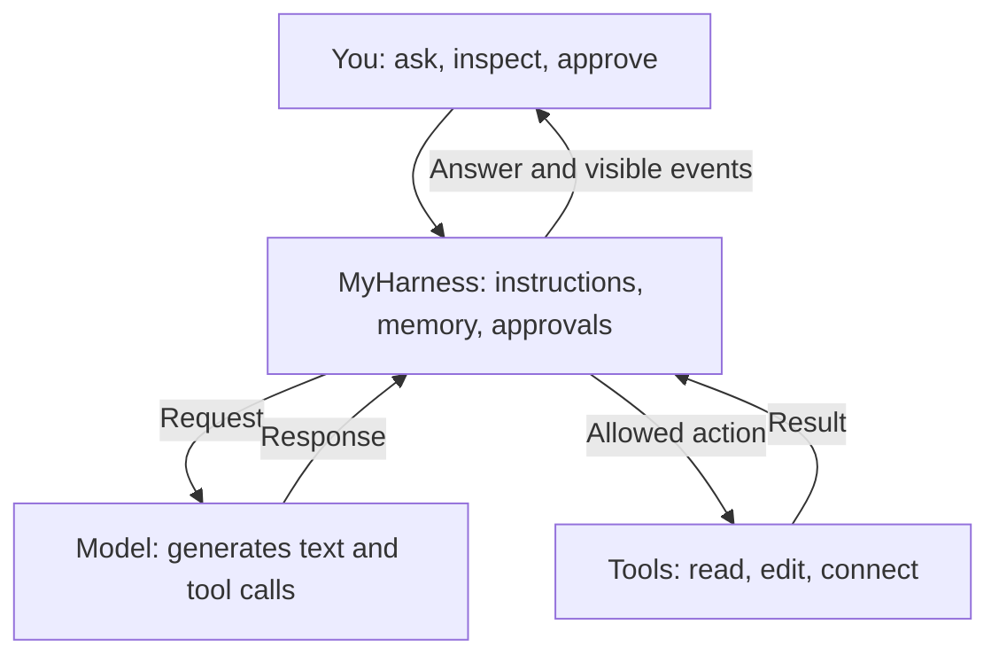
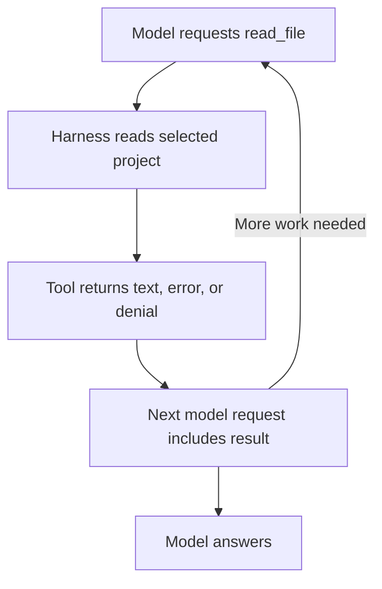

# MyHarness — Learn what happens behind an AI answer

An open laboratory for curious people.

Learn to use MyHarness by taking it apart, one small experiment at a time. Discover what the model sees, how tools act, and why context matters.

- 12 guided experiments
- Beginner friendly; no background knowledge needed
- Diagrams and explanations
- Hands-on exercises in the real app

This is the Markdown companion to the [interactive HTML guide](myharness-learning-guide.html). It contains the same lessons. Interactive demonstrations are presented as static examples; progress can be recorded with the checkboxes below.

This guide works offline in a Markdown reader. To perform the exercises, open MyHarness separately. The examples never contact a model, access a folder, or execute a tool. Mermaid diagrams require a supporting renderer such as GitHub.



## Learning path

- [ ] [Step 01: Meet your harness](#step-01-meet-your-harness)
- [ ] [Step 02: Choose where the model runs](#step-02-choose-where-the-model-runs)
- [ ] [Step 03: Send your first request](#step-03-send-your-first-request)
- [ ] [Step 04: Experiment with memory](#step-04-experiment-with-memory)
- [ ] [Step 05: Shape the instructions](#step-05-shape-the-instructions)
- [ ] [Step 06: Give the model a tool](#step-06-give-the-model-a-tool)
- [ ] [Step 07: Approve or deny a change](#step-07-approve-or-deny-a-change)
- [ ] [Step 08: Load a skill](#step-08-load-a-skill)
- [ ] [Step 09: Discover external tools with MCP](#step-09-discover-external-tools-with-mcp)
- [ ] [Step 10: Explore tokens and context](#step-10-explore-tokens-and-context)
- [ ] [Step 11: Compact, reset, and save](#step-11-compact-reset-and-save)
- [ ] [Step 12: Run your own investigation](#step-12-run-your-own-investigation)

## Step 01: Meet your harness

*Understand who does what*

A model generates a response from an input. MyHarness assembles that input, offers tools, checks approvals, runs allowed actions, and sends the results back. The browser lets you inspect each of these steps.

### Try it in MyHarness

1. Open MyHarness and locate **Chat**, **Internals**, and **Explore**.
2. Use Chat to follow the conversation. Use Internals to inspect API exchanges and tool effects. Use Explore to inspect the ingredients of a request.
3. Keep these three views in mind throughout this guide: conversation, evidence, and construction.

### Three views, three questions

**Chat:** What did the assistant say and do?

**Internals:** What crossed the API boundary?

**Explore:** What made up the request?

Use evidence from all three before deciding how a behavior works.

**What you learn**

An answer is the visible outcome of a process. MyHarness makes that process inspectable.

Pause and explain: Which part creates text, and which part actually opens a file?

- [ ] I explored this step.

## Step 02: Choose where the model runs

*Separate the harness from inference*

Inference means running the model to generate an answer. The browser edition runs the harness in a browser Worker; Ollama or a cloud provider runs inference separately.

### Try it in MyHarness

1. Choose **Local Ollama** or an available cloud provider in the toolbar.
2. For Ollama, provide the server URL and select an installed model. For a cloud provider, enter your own API key and select an available model.
3. Click **New Session**. Send a short greeting and check that a response arrives.

### Choose an execution environment

| Edition | What runs where? |
| --- | --- |
| Browser | Harness and UI on your machine; inference on Ollama or the selected provider. No Bash. |
| Node | Same core harness in Node; browser UI or terminal runner. Bash available in supported Linux/WSL environments. |

Direct folder access needs a supporting browser such as Chrome or Edge, using HTTPS or localhost.

**What you learn**

Local Ollama uses your model server. A cloud provider receives the request payload and bills API usage to its account. A paid chat subscription does not configure an API account.

Pause and explain: Can you identify where your selected model runs?

- [ ] I explored this step.

## Step 03: Send your first request

*Look beyond the chat bubble*

Each model call has an outgoing request and an incoming response. Internals lets you compare what you typed with what was actually sent.

### Try it in MyHarness

1. Send: `Explain what an AI harness does in three sentences.`
2. Open Internals and find the corresponding **SENT** and **RECEIVED** blocks.
3. Find your message inside SENT. Then look for the instructions and any enabled tool definitions included alongside it.

### Read a payload like a checklist

① Instructions set the task framing.

② Retained messages provide continuity.

③ Tool definitions advertise available operations.

④ Your latest message asks for work.

This is a conceptual map. Inspect the native SENT body for your provider’s actual format.

**What you learn**

The model receives a structured payload, not just the last sentence you typed. Provider formats can differ.

Pause and explain: What extra information accompanied your question?

- [ ] I explored this step.

## Step 04: Experiment with memory

*Discover why a conversation feels continuous*

Harness memory is retained conversation content that is sent again in later requests. It is different from the model learning new facts in its weights.

### Try it in MyHarness

1. With **Harness memory** on, say: `My favourite number is 42.`
2. Ask: `What is my favourite number?` Compare the two SENT blocks and locate the earlier exchange.
3. Turn memory off and ask again. In this UI, turning memory off resets retained memory. Inspect the shorter payload; the visible transcript can still contain the old exchange.

### Offline experiment: what gets sent?

We already said “My favourite number is 42.” Toggle retained memory to inspect an illustrative next request.

**Guide simulation — no model call**

We already said “My favourite number is 42.” Compare the illustrative next requests.

**Memory on:**

```json
{
  "messages": [
    { "role": "user", "content": "My favourite number is 42." },
    { "role": "assistant", "content": "Got it." },
    { "role": "user", "content": "What is my favourite number?" }
  ]
}
```

The earlier fact is present in the input.

**Memory off:**

```json
{
  "messages": [
    { "role": "user", "content": "What is my favourite number?" }
  ]
}
```

The fact is absent. The model has no evidence of it in this illustrated request.

**What you learn**

An old chat bubble remaining on screen does not prove it was sent to the model. Inspect SENT to see what the model could use.

Pause and explain: If the answer is still 42 without that fact in SENT, is it proof of memory—or could it be a guess?

- [ ] I explored this step.

## Step 05: Shape the instructions

*Understand how behavior is guided*

A base prompt, agent persona, and project AGENTS.md can be composed into the system message. They guide behavior without changing the model itself.

### Try it in MyHarness

1. In Explore, inspect the instruction components used to build the request.
2. Try a concise persona or base instruction such as `Explain terms for a beginner. Use one concrete example.` in a new session.
3. Ask the same question in separate sessions with different instruction snapshots. Compare SENT first, then compare the answers.

### Try a controlled comparison

**Question:** “Explain a token.”

**Session A:** “Explain for a beginner.”

**Session B:** “Explain for a software engineer.”

Use the same model and tools. Compare the instruction payloads before comparing the answers.

Separate sessions avoid carrying the first answer into the second experiment.

**What you learn**

Instruction text is input. It can influence an answer, but it is not a guarantee. Community prompt-library examples have unverified attribution and do not recreate another product’s tools.

Pause and explain: Did the instruction change—and did the answer actually follow it?

- [ ] I explored this step.

## Step 06: Give the model a tool

*Follow a complete action loop*

A tool definition describes an operation and its arguments. The model can request that operation; the harness executes it and returns a result. The model can then use that result in its answer.

### Try it in MyHarness

1. Open a small scratch project using **Open local folder…**, or use **Import folder copy** for a virtual project.
2. Enable `pwd`, `list_files`, and `read_file`. Ask: `List the project files, then read README.md if it exists.`
3. In Internals, follow the tool name and arguments, execution result, and subsequent SENT block containing that result. If no call occurs, record that too.

### Follow the evidence



One user message can produce several model calls.

**What you learn**

Saying “I read the file” is not evidence of execution. Look for the call and its result. A model may fail to request an enabled tool.

Pause and explain: Can you trace a fact in the final answer back to a tool result?

- [ ] I explored this step.

## Step 07: Approve or deny a change

*Learn how you control actions*

Approvals let you inspect a proposed write, edit, or shell command before execution. Denial is also information: the harness sends it back as a tool result.

### Try it in MyHarness

1. Use a scratch project and keep approvals on. Enable `write_file`.
2. Ask: `Create lesson-note.txt containing: I am learning how tools work.` Inspect the proposed change, then deny it.
3. Check the denial in Internals and verify that the file was not created. Repeat and approve only if you want the file.

### Offline experiment: a proposed write

**Guide simulation — no files are changed**

```diff
+ lesson-note.txt
+ I am learning how tools work.
```

- **Approve:** illustrated result: write succeeded. The model receives confirmation that `lesson-note.txt` was created.
- **Deny:** illustrated result: user denied the write. No file is created; the model receives the denial.

In the real app, inspect the entire diff or command and its target before making this choice.

**What you learn**

Direct folder access writes to your actual disk. Imported copies change a virtual project. In the browser, run_command is unavailable; the Node edition can run Bash with your account’s permissions and has no shell sandbox.

Pause and explain: What exactly would the proposed action change?

- [ ] I explored this step.

## Step 08: Load a skill

*See instructions appear on demand*

A skill offers a short description first, then loads fuller instructions when used. It teaches a workflow; it does not independently execute the work or create a new tool.

### Try it in MyHarness

1. Enable `use_skill` and inspect the offered skill descriptions.
2. Type `/write-readme` followed by a request. Recognized skill names are highlighted blue and slash autocomplete can help you choose.
3. Inspect the loaded instructions and later request. Compare their size and detail with the original short description.

### Guidance becomes available

1. **Description:** a small discovery hint offered to the model.
2. **Full instructions:** loaded on demand when the skill is used.
3. **Tool actions:** read, propose, and write; approvals still apply.

**What you learn**

A skill supplies guidance. File tools still do the reading and writing, and applicable approvals still govern those actions.

Pause and explain: Which part was instruction text, and which part performed an action?

- [ ] I explored this step.

## Step 09: Discover external tools with MCP

*Understand connections to other services*

MCP, the Model Context Protocol, lets external servers provide tools, instructions, resources, and prompts. A server must be connected before its actual tools are known.

### Try it in MyHarness

1. Open **Explore → MCP servers → Find MCP servers…**. Search the official registry and inspect an entry.
2. For a remote server, use **Preview tools** to inspect its advertised tools, prompts, and resources without invoking tools. Use **Show configuration** to see its connection requirements.
3. After configuring a trusted server, select the tools you want to offer. Inspect a call’s approval and JSON-RPC request/response in Internals or the server view.

### Four things a server can offer

**Tools:** callable operations.

**Instructions:** guidance added while its tools are selected.

**Resources:** content listed/read through resource tools.

**Prompts:** workflows invoked with `/mcp__server__prompt`.

Registry preview is discovery. It does not execute advertised tools or run local packages.

**What you learn**

New-session MCP tools start unticked. With approvals on, every external tool call requests approval. Browser MCP connections require compatible HTTP/CORS; local stdio servers require Node. OAuth sign-in is not currently supported.

Pause and explain: What can this server do, and what arguments would your call send?

- [ ] I explored this step.

## Step 10: Explore tokens and context

*Understand the model’s working space*

Tokens are model-specific pieces used to encode input and output. Context includes instructions, retained messages, tool definitions and results. A longer transcript can increase context pressure.

### Try it in MyHarness

1. Inspect the context meter and compare a short exchange with a longer one containing tool output.
2. Open **Explore → tokenization of a saved request**. Select a model call and click **Inspect selected request**.
3. Read the evidence label. When pieces are available, click one to see its position, ID, and bytes. Count-only or unavailable results do not expose token boundaries.

### Offline experiment: a working budget

**Invented teaching values — not a token estimate**

| Budget component | Initially | After adding a large tool result | After also summarizing memory |
| --- | --- | --- | --- |
| Instructions | 12% | 12% | 12% |
| Memory | 20% | 20% | 8% |
| Tool results | 10% | 22% | 22% |
| Output reserve | 20% | 20% | 20% |
| Total allocated | 62% | 74% | 62% |
| Remaining | 38% | 26% | 38% |

Adding a tool result uses more of the working budget. Summarizing memory reduces the memory portion. Resetting this illustration restores the initial values; this is separate from resetting memory in the real harness.

Real token sizes depend on the model and payload. Summarizing memory cannot remove tool definitions or guarantee all important facts survive.

**What you learn**

A token count is not a full inference trace. Configured tokenizers and provider text tokenization have coverage limits; cloud internal templates are unavailable. Fresh inspection may use provider quota or load a local model.

Pause and explain: Is this number measured, estimated, count-only, or based on only part of the text?

- [ ] I explored this step.

## Step 11: Compact, reset, and save

*Distinguish a transcript from working memory*

Compaction asks the selected model to summarize retained memory. Reset clears retained memory. Neither operation erases the saved transcript. A summary is lossy and may omit useful details.

### Try it in MyHarness

1. Create a short conversation with a goal, a constraint, and a decision. Inspect retained memory in Explore.
2. Use the compaction control and inspect its separate model request and resulting summary. Compare the original details with the summary. Ineffective or interrupted summaries leave memory unchanged.
3. Use **Export session** to save the transcript, current model memory, and instruction snapshot. The session JSON includes the project workspace path; project files stay in the workspace.

### What are you preserving?

| Action | Effect |
| --- | --- |
| Compact | Replace retained memory with a useful summary when successful. |
| Reset memory | Clear what the harness retains for later calls. |
| Export session | Save transcript, retained memory and instruction snapshot; no project files. |

**What you learn**

Browser saves belong to the site origin and browser profile. Clearing site data removes them; changing the host or port uses different storage. Inspect exports before sharing because they can contain file contents and local paths.

Pause and explain: Could a new response still recover a detail omitted from retained memory?

- [ ] I explored this step.

## Step 12: Run your own investigation

*Change one thing and follow the evidence*

You now have a repeatable method: predict a behavior, change one setting, inspect the actual request and actions, and compare the result. This makes MyHarness a laboratory for understanding AI systems.

### Try it in MyHarness

1. Choose a question: Does memory change the input? Does a skill load more instructions? Does denying a tool change the next answer?
2. Use a small project and separate sessions to compare two conditions while keeping the provider, model, and task the same. Record prompts, enabled tools, and relevant instruction snapshots.
3. Inspect evidence before drawing a conclusion. Repeat if needed: generation can vary. Explain both the observation and its limits.

### Your experiment notebook

**Question:** What behavior am I investigating?

**Prediction:** What do I expect to change?

**Setup:** Model, instructions, tools, memory state.

**Evidence:** Payload, call, result, approval.

**Conclusion:** What happened? What is still uncertain?

Start with one variable. Small experiments are easier to understand and explain.

**What you learn**

Displayed model thinking is text exposed by the provider, not guaranteed access to its internal reasoning. The guide’s demonstrations are illustrative; live tool results and SENT blocks are your evidence.

Pause and explain: Can another learner reproduce your experiment from your notes?

- [ ] I explored this step.

## A small glossary

### Model, harness, and inference

**Model:** the system generating output from input. **Harness:** the software arranging instructions, memory, tools, and actions around it. **Inference:** running the model to produce an output.

### Memory, transcript, and context

**Transcript:** the visible record of the conversation. **Retained memory:** the conversation content kept for future calls. **Context:** the input available on a particular call, including instructions and tools. These are related, but they are not identical.

### Tool, skill, and MCP server

**Tool:** a callable operation. **Skill:** instructions for a workflow. **MCP server:** an external provider of tools and other context through a shared protocol.

### Tokens, compaction, and evidence

**Token:** a model-specific encoding piece. **Compaction:** summarizing memory to reduce its size. **Evidence:** the actual payloads, calls, results, and explicitly labelled measurements you can inspect.

### Next discoveries

After these experiments, explore Ollama templates and the illustrative Qwen prompt reconstruction in Explore, compare provider-native payloads, or use the headless runner to observe the same harness without the interface. Read the architecture documentation before extending the backend.

This guide describes documented learning features. Multiple independent subagents, media input, hosted provider tools, and advanced reasoning controls are not presented as available exercises.

---

Based on the project documentation retrieved on 6 October 2026. Labels and availability can change as the project evolves.

[Project README](https://github.com/StreamingBoss/myharness/blob/main/README.md) · [Tokenization and evidence limits](https://github.com/StreamingBoss/myharness/blob/main/TOKENIZATION.md) · [Architecture](https://github.com/StreamingBoss/myharness/blob/main/ARCHITECTURE.md)

The guide does not connect to services. Real exercises use your selected provider and enabled project tools. Keep the Node HTTP service on localhost; use a scratch project for learning.

